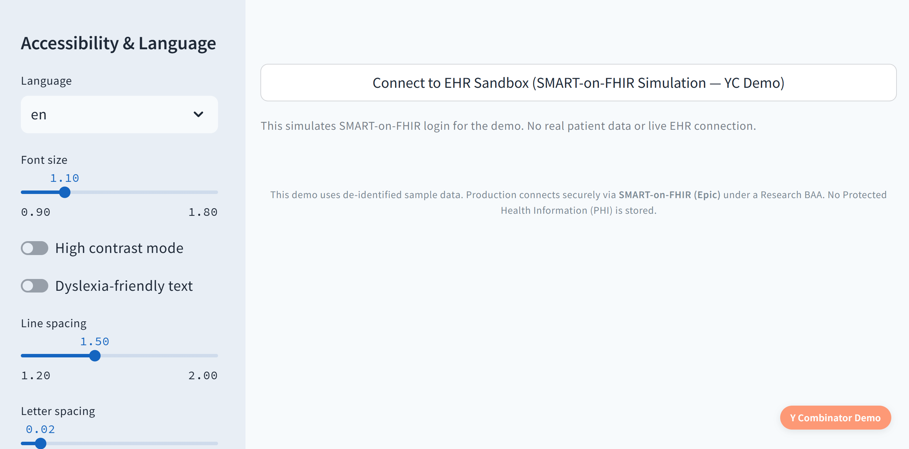
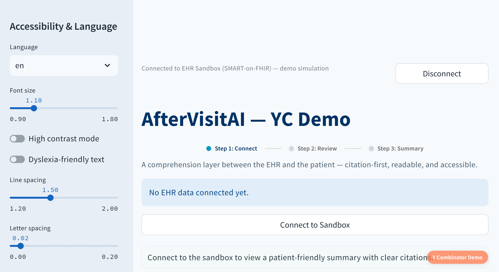
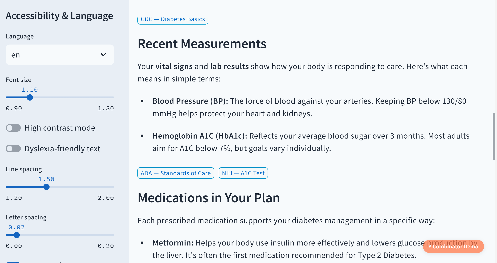
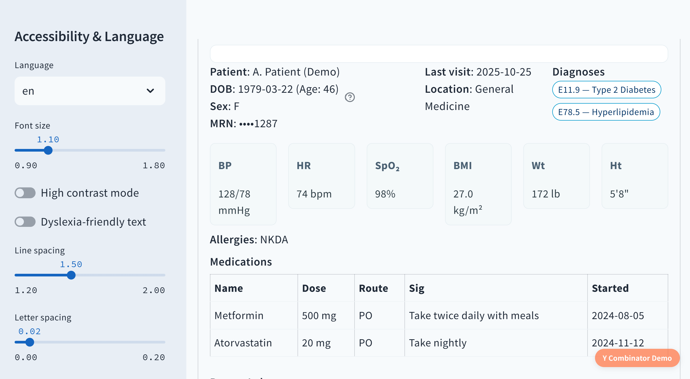

# AfterVisitAI — Demo (Public Overview)

AfterVisitAI is a **patient-first comprehension layer** that turns complex medical visit notes into **clear, trusted after-visit guidance** — verified against **CDC, NIH, and ADA** sources.  
It helps patients leave every appointment with confidence, not confusion.

> **Problem:** Patients remember only 20–60% of what clinicians say — and much of that is misremembered.  
> **Solution:** AfterVisitAI provides evidence-anchored summaries that translate medical complexity into everyday clarity.

---

## 🧩 About This Public Repo
This repository offers a **safe, high-level overview** of our MVP demo:  
- Product vision & screenshots (synthetic, non-PHI data)  
- Conceptual architecture for our comprehension engine  
- No proprietary code or model details (private for HIPAA/IP protection)

**Live demo:** available upon request (HIPAA-safe synthetic data).

---

## 🚀 Core System Pillars

AfterVisitAI is built on four proprietary components that work together to ensure clarity, accuracy, empathy, and safety:

- **ClarityCore™** — transforms medical data into plain-language insights  
- **ProofWeave™** — anchors every statement to trusted scientific evidence  
- **HumanSense™** — ensures tone, empathy, and patient-readable language  
- **TrustLoop™** — provides safety, transparency, and human-in-the-loop governance  

> The specific algorithms, prompts, and data flows powering these systems are confidential and not shared publicly.

---

## ⚙️ MVP Flow (Non-PHI Demo)

1. **Connect (Sandbox)** — secure SMART-on-FHIR-style connection using synthetic patient data  
2. **Review** — processes and normalizes structured visit information  
3. **AfterVisit™ Summary** — delivers an easy-to-read, cited summary with clear next steps  

---

## 🖼️ Screenshots (Synthetic, Non-PHI)

*Main dashboard with the 3-step flow — Connect → Review → AfterVisit™ Summary.*

*SMART-on-FHIR style connection using **synthetic patient data** (no PHI).*

*Example of an AfterVisit™ Summary generated from synthetic patient data — clear, cited, and easy to follow.*

*Structured **synthetic patient profile** used for demo testing — fully HIPAA-safe.*

---

## 🔒 Privacy & IP Statement

- **Zero-PHI Design:** The demo operates entirely on synthetic data for compliance.  
- **Confidential Architecture:** Core logic and retrieval frameworks are private, forming part of our IP moat.  
- **Partnership Access:** YC reviewers and approved collaborators can see a live walkthrough under NDA.

---

## 📬 Contact

**Founder & CEO:** Yasamin Habibi. MD — [ava@aftervisitai.com](mailto:ava@aftervisitai.com)  
**Company:** AfterVisitAI, Inc. — *The Language of Healing™*  

> *A clear mind leads a trustworthy mission.*

